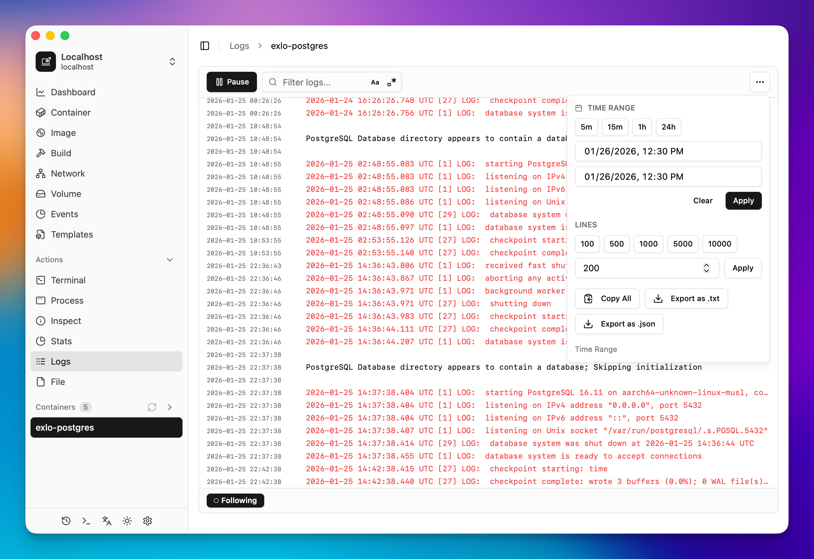
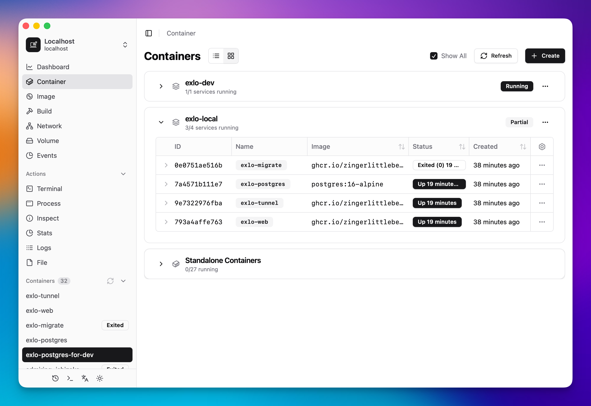
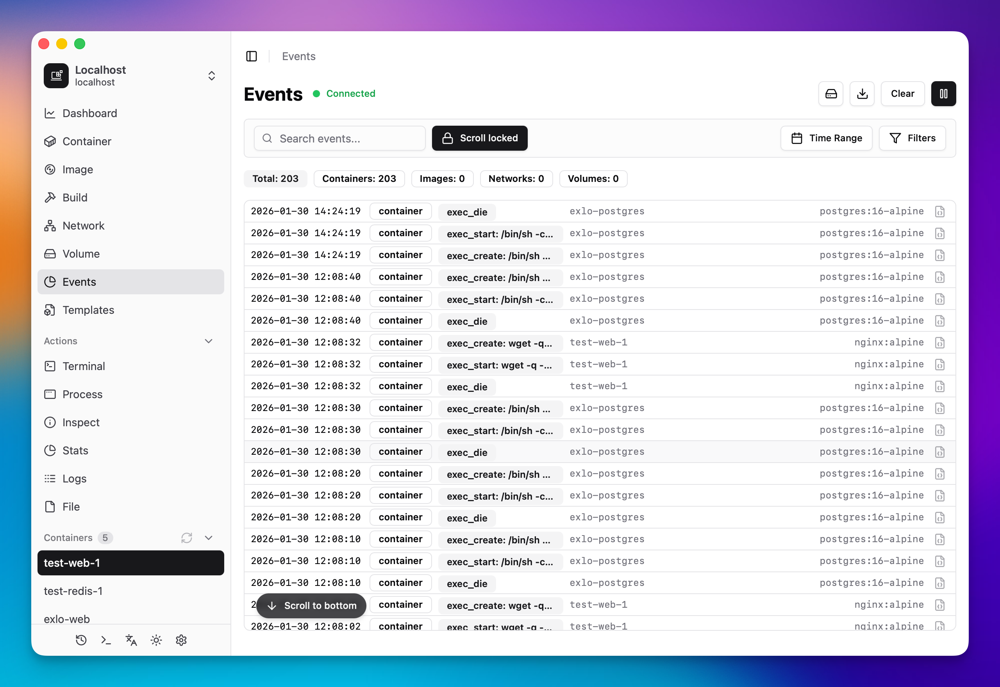
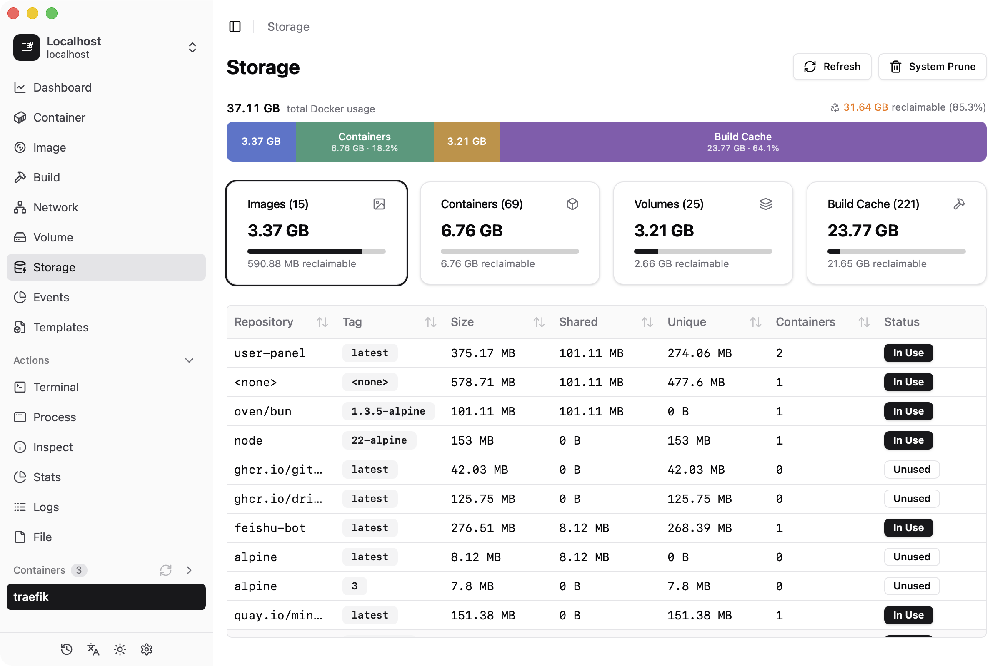

# Dockerman

Language: 🇺🇸 English | [🇨🇳 简体中文](./README.zh-CN.md)

A modern, lightweight Docker management UI built with Tauri and Rust.
Focus on simplicity and performance for Docker container management.

- 🚀 Fast startup and minimal resource usage
- 💻 Powerful performance with Tauri
- 🎯 Clean, focused interface
- 📊 Real-time container monitoring
- 🔒 Local-only operation
- 🌙 Comprehensive dark mode support
- 🌐 Internationalization (i18n) support

## Features

### Dashboard Overview

- 📊 Container and image statistics at a glance
- 💾 Total image size monitoring
- 🔄 Real-time container status updates
- 📈 Resource usage visualization
- 🖥️ System information display (Docker version, OS, architecture, resource limits)
- ⚡ Parallelized container stats queries for faster dashboard loading

### Storage

- 💾 Docker disk usage breakdown (images, containers, volumes, build cache) with interactive chart
- 🧹 One-click system prune

### Container Management

- 📋 Detailed container list with status indicators
- 🔍 Quick search for containers with real-time filtering and clear reset
- 🐳 Docker Compose View
  - Toggle between flat list and grouped view by Compose projects
  - Compose project cards with status indicators and running container counts
  - Collapsible Standalone Containers section for non-Compose containers
  - Full Compose lifecycle management (Up, Stop, Restart, Pull, Remove)
  - Support for all Docker Compose CLI options (file, env-file, profile, progress, dry-run)
- 🐳 Container creation dialog with dual input modes
  - Form-based configuration for guided setup
  - Docker command input mode with parsing support
  - Docker Run command import and parsing with enhanced UI
- 🔍 Container inspection with detailed information
  - Port mappings
  - Network settings
  - Mount points
  - Container labels
- 📊 Resource monitoring
  - CPU usage and distribution
  - Memory usage
  - Network statistics
  - Block I/O statistics
- 💻 Integrated terminal access
  - Terminal theme picker with color theme customization
  - Configurable default shell and user
- 📝 Process list viewing
- 📜 Log viewer with real-time updates
  - Virtualized log list with follow/pause and load-more history
  - Keyword/regex filtering with highlight and quick shortcuts
  - Export logs as TXT/JSON and copy filtered results
  - Newest-first log ordering, consistent with events page
  - Keyboard shortcuts (`P` pause, `/` search, `g` newest, `G` oldest) with on-screen hints
- 📂 Container File Browser
  - File tree navigation with dynamic loading
  - Folder upload and download support
  - Single file upload and download with mode preservation
  - Symlink support and pagination for large directories
  - Context menus for file/folder operations

### Docker Events

- 🔔 Real-time Docker event listening
- 🔔 Desktop notifications for abnormal container events (non-zero exit, OOM killed, health check failure)
- 🔍 Comprehensive event filtering and search
- 📋 JSON details dialog for inspecting event data
- ⚡ Action buttons with Copy JSON and Remove options
- ⌨️ Keyboard shortcuts (`P` pause, `/` search, `g` newest, `G` oldest) with on-screen hints

### Template Management

- 🧩 Stack templates support with migrations, UI, and API integration

### Image Management

- 📦 Image list with size and tag information
- 🗑️ Batch Operations: Multi-select batch delete for Images, Networks, and Volumes
- 🏗️ Image Build
  - Build from Dockerfile
  - Support for build args and tags
  - Real-time build log streaming
  - Historical log playback
  - Docker build command generation and parsing functionality
  - Rebuild previous builds from history with pre-filled parameters
  - Retry failed builds without re-entering configuration
- 📉 Image Size Analysis
  - Detailed breakdown of layer sizes
  - Interactive size distribution bar with color-coded blocks
  - Layer details table with expand/collapse for Dockerfile commands
  - Collapsible distribution panel with compact view support
  - Export layer analysis as JSON or copy to clipboard
- 🐳 Streaming I/O for large image export and import
- 🕒 Creation time tracking
- 🔍 Detailed image inspection
- 📊 Usage statistics
  - Total count
  - Size analytics
  - Usage tracking

### Network Management

- 🔍 Quick search for networks by name, ID, driver, and status

### Volume Management

- 📂 Volume File Browser with upload and download support
- 🔍 Quick search for volumes with real-time filtering and clear reset

### App Log Viewer

- 📋 Custom HTML-based log viewer with keyword search, level filtering, detail dialog, and export support

### Command Palette & System Tray

- 🔍 Global command palette (Cmd+; / Ctrl+;) for quick access to containers, images, compose projects, networks, and volumes
- 🖥️ System tray icon with connection status, resource stats, and quick actions
- 📊 Optional real-time CPU & memory stats in the macOS menu bar
- 🙈 Auto-hide dock icon when the main window is closed on macOS
- ⌨️ Configurable global keyboard shortcut for the command palette

### System Integration

- ⌨️ Wayland global keyboard shortcut support via XDG Desktop Portal
- 🔌 Native Docker daemon connection
  - Custom Docker socket path support
  - TCP connection support for remote Docker daemon
  - SSH socket forwarding for remote connections
- 🔑 License activation and management with license gate for remote host features
  - 📡 Host latency display with ICMP ping and one-click refresh
  - 🗑️ Host removal with confirmation dialog
- 🔐 Private registry credential management with auto-matching on image pull
- 🛡️ Error boundary with recovery UI for unexpected component errors
- 📁 Sidebar collapsible sections with container count badges
- 🚀 Lightweight and fast performance
- 💻 Cross-platform desktop application
