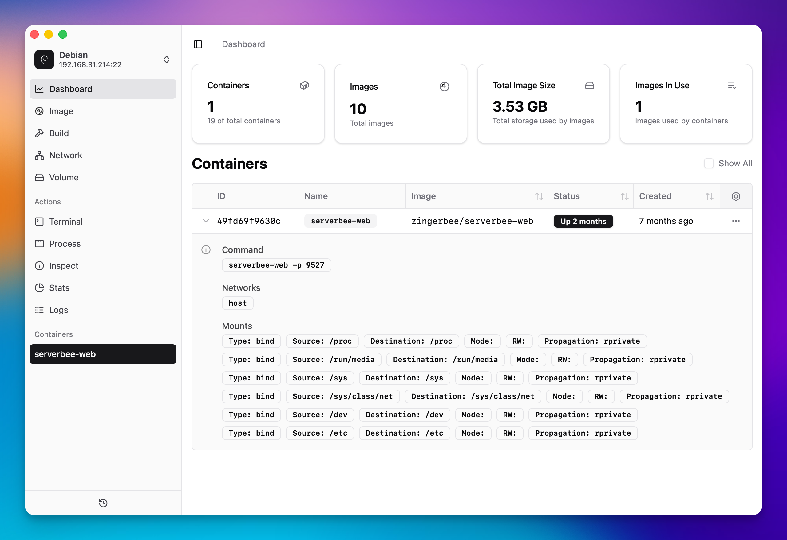

# Dockerman

A modern, lightweight Docker management UI built with Tauri and Rust.
Focus on simplicity and performance for Docker container management.

- 🚀 Fast startup and minimal resource usage
- 💻 Powerful performance with Tauri
- 🎯 Clean, focused interface
- 📊 Real-time container monitoring
- 🔒 Local-only operation

## Features

### Dashboard Overview

- 📊 Container and image statistics at a glance
- 💾 Total image size monitoring
- 🔄 Real-time container status updates
- 📈 Resource usage visualization

### Container Management

- 📋 Detailed container list with status indicators
- 🔍 Container inspection with detailed information
  - Port mappings
  - Network settings
  - Mount points
  - Container labels
- 📊 Resource monitoring
  - CPU usage and distribution
  - Memory usage
  - Network statistics
  - Block I/O statistics
- 💻 Integrated terminal access
- 📝 Process list viewing
- 📜 Log viewer with real-time updates

### Image Management

- 📦 Image list with size and tag information
- 🕒 Creation time tracking
- 🔍 Detailed image inspection
- 📊 Usage statistics
  - Total count
  - Size analytics
  - Usage tracking

### System Integration

- 🔌 Native Docker daemon connection
- 🚀 Lightweight and fast performance
- 💻 Cross-platform desktop application
