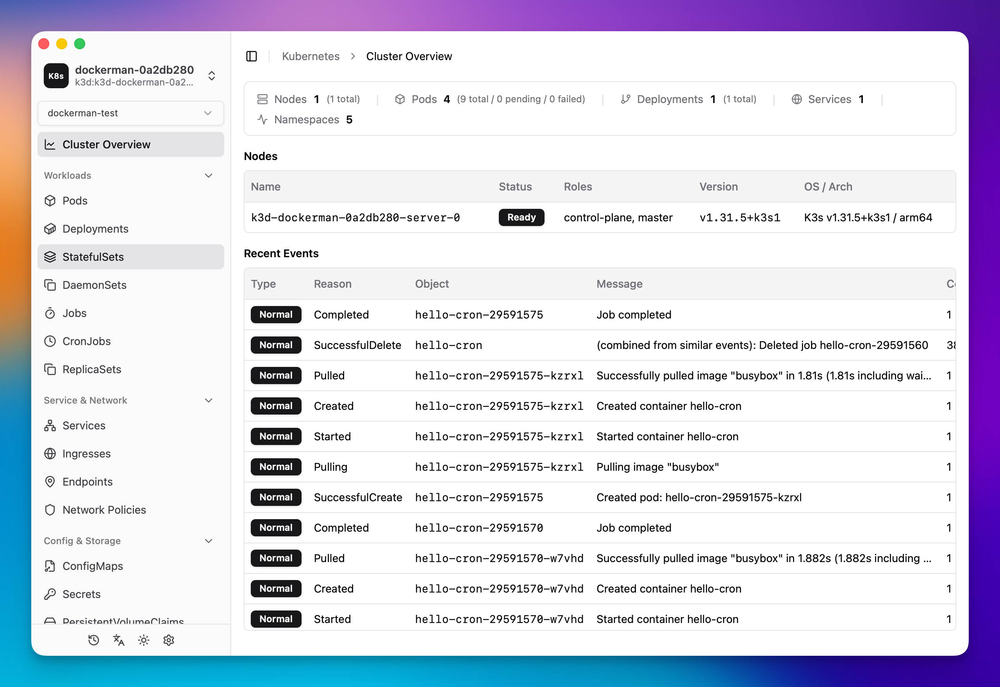
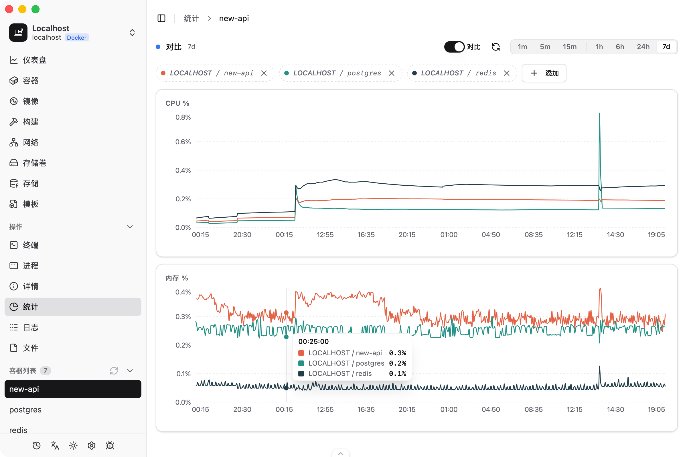

# Dockerman

Language: 🇺🇸 English | [🇨🇳 简体中文](./README.zh-CN.md) | [🇯🇵 日本語](./README.ja.md) | [🇪🇸 Español](./README.es.md)

A native desktop UI for managing Docker **and** Kubernetes — built with Tauri + Rust. Fast to launch, light on resources, and entirely local: nothing leaves your machine.

## Highlights

- 🐳 **Containers & Images** — full lifecycle, Compose support, backup/restore (incl. bind mounts), upgrade detection
- ☸️ **Kubernetes** — multi-cluster, all major resources, Helm, port forwarding, YAML editor with dry-run
- 🖥️ **Built-in tools** — terminal, log viewer with search, CPU/memory history, file browser with editing
- 🔔 **Image upgrade watch** — background service with desktop notifications when updates land
- ☁️ **Cloudflared tunnels** — one-click public URLs with auto cleanup
- 🐙 **Podman & WSL2 engine** — first-class alternatives to Docker Desktop
- 🌐 Localized in English, 中文, 日本語, Español, with comprehensive dark mode

## Containers & Images

Manage everything from one place without dropping to a shell:

- Group containers by Compose project or browse a flat list; quick filters by name, port, or status
- Create from a guided form or paste a `docker run` command — convert it to Compose YAML in the built-in editor
- Live logs with keyword/regex search and case-sensitive toggle; CPU/memory history with multi-container compare (up to 6)
- Themeable terminal, process list, and a file browser with in-place editing, previews (text/code/images/PDF/video), and folder up/download
- Backup and restore the whole container — config, filesystem, volumes, and supported bind mounts
- Image build (Dockerfile or parsed command), push to private registries, Docker Hub search, Trivy security scan, and per-layer size analysis
- Background image-upgrade watch with per-channel subscriptions, registry credential resolver, and `dockerman://` deep links

## Kubernetes

Cluster management on par with `kubectl`, but visual:

- Connect via kubeconfig or spin up a local k3d cluster (auto-installed); switch between clusters independently from your Docker hosts
- Workloads, Networking, Config & Storage, RBAC, CRDs — plus dedicated Node, Persistent Volume, and Namespace pages
- Filterable cluster events browser and overview cards for CPU and memory
- Built-in YAML editor with deep-link routing and server-side dry-run preview
- Helm releases, repos, and chart install
- Port forwarding with automatic local DNS for forwarded services
- Debug assistant for unhealthy Pods; force-delete for Pods stuck terminating
- Typed 403 handling surfaces permission errors at the list level

## Beyond Docker

- **Cloudflared Tunnels** — expose any container port with one click; tunnels auto-clean on stop/destroy and survive crashes
- **Podman** — auto-detected runtime with per-host preference and feature gating for Compose-only flows
- **WSL2 Engine on Windows** — no Docker Desktop required; one-click Alpine setup with crash recovery and registry mirrors
- **Remote daemons** — custom socket, TCP, or SSH forwarding with heartbeat reconnect and per-host latency display

## Operations & Quality of Life

- 🚨 Preset alert rules (restart loop, container crash) and a recent-alerts feed with container, time, and rule
- 🧰 One-click diagnostic bundle (logs, inspect, host state) for support escalations
- 📝 Visual `.env` editor that preserves comments and applies atomically
- 🔍 Global command palette (Cmd/Ctrl+;) and a system tray with live CPU/memory stats
- 🔐 Private registry credential management with auto-matching on pull
- 🔑 License activation for remote-host features

## Why It Feels Fast

Built on Tauri + Rust as a native desktop app — not Electron, not a browser tab. Local-only operation, no telemetry, no remote dependencies for core features.

## More Screenshots

